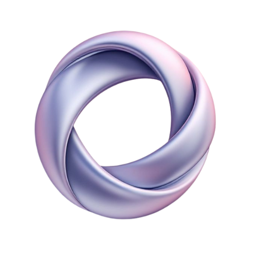

<div align="center">
  


  # SynthcastAI - AI-Powered Podcast Creation Platform

  [](https://nextjs.org/)
  [](https://www.typescriptlang.org/)
  <p>Create and generate AI-powered podcasts with customizable voices and automated content generation</p>
</div>

## Relevant Links

- $CAST: 
- Website: https://synthcastai.com
- Twitter: https://x.com/synthcastai

## Features

- 🎙️ AI Voice Generation with multiple voice options (alloy, shimmer, nova, echo, fable, onyx)
- 🤖 GPT-4 powered content generation
- 🎨 AI Image generation for podcast thumbnails
- 🎵 Interactive audio player with progress tracking
- 🔍 Advanced podcast search and discovery
- 📱 Responsive design across all devices

## Tech Stack

### Frontend
- Next.js 14
- TypeScript
- Tailwind CSS
- Framer Motion
- Convex
- Radix UI Components
- Uploadstuff

### Backend
- OpenAI API (GPT-4, TTS)
- Convex Database
- Node.js

## Getting Started

1. Clone the repository:

    ```console
    git clone https://github.com/yourusername/synthcast-ai.git
    cd synthcast-ai
    ```

2. Install dependencies:

    ```console
    npm install
    ```

3. Set up environment variables:

    ```console
    OPENAI_API_KEY=your_openai_api_key
    NEXT_PUBLIC_CONVEX_URL=your_convex_url
    ```

4. Run the development server:

    ```console
    npm run dev
    ```

## Project Structure

- `/app` - Next.js application routes and pages
- `/components` - Reusable React components
- `/convex` - Convex backend functions and schema
- `/public` - Static assets
- `/hooks` - Custom React hooks
- `/providers` - React context providers
- `/constants` - Application constants and configurations

## License

This project is licensed under the MIT License - see the LICENSE file for details.